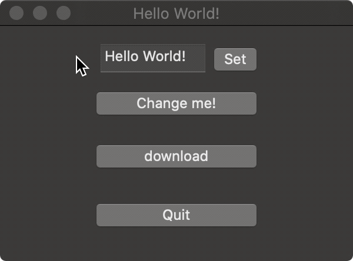

# What is this?

> This is a friendly fork of [@mojbro](https://github.com/mojbro)'s gocoa package with some additional features and bug fixes so it is suitable as Cocoa backend of my [Spot](https://github.com/roblillack/spot) GUI toolkit. I'll be in touch with the original author to get my changes upstreamed or make this a proper, maintained fork. Original README follows.
>
> —[@roblillack](https://github.com/roblillack)
>
> #### Changes to original
>
> - 2024-05-22 [#2](https://github.com/roblillack/gocoa/pull/2): Update deprecated NSButton enums (by @dim13)
> - 2024-05-14 [e85e4be](https://github.com/roblillack/gocoa/commit/e85e4be) progressindicator: Don't hide by default as this would increase time to create widgets in the first place
> - 2024-05-14 [724ee73](https://github.com/roblillack/gocoa/commit/724ee73) textview: Add hacky SetFontSize functionality.
> - 2024-05-14 [57058d9](https://github.com/roblillack/gocoa/commit/57058d9) window: Flip all views by default
> - 2024-05-14 [c93457a](https://github.com/roblillack/gocoa/commit/c93457a) application: Add RunOnMainLoop

# gocoa

[](https://godoc.org/github.com/mojbro/gocoa)
[](https://goreportcard.com/report/github.com/mojbro/gocoa)

Go bindings for the Cocoa framework to build macOS applications.



## How to use

The following is a basic [Hello World](examples/helloworld) application.

```go
package main

import (
	"fmt"

	"github.com/mojbro/gocoa"
)

func main() {
	gocoa.InitApplication()
	gocoa.OnApplicationDidFinishLaunching(func() {
		fmt.Println("App running!")
	})
	wnd := gocoa.NewWindow("Hello World!", 150, 150, 300, 200)

	// Change me button
	currentTitle, nextTitle := "Change me!", "Change me again!"
	changeButton := gocoa.NewButton(75, 125, 150, 25)
	changeButton.SetTitle(currentTitle)
	changeButton.OnClick(func() {
		changeButton.SetTitle(nextTitle)
		currentTitle, nextTitle = nextTitle, currentTitle
	})
	wnd.AddButton(changeButton)

	// Quit button
	quitButton := gocoa.NewButton(75, 50, 150, 25)
	quitButton.SetTitle("Quit")
	quitButton.OnClick(func() { gocoa.TerminateApplication() })
	wnd.AddButton(quitButton)

	wnd.MakeKeyAndOrderFront()
	gocoa.RunApplication()
}
```

## Status of this project

This package is very, very early and incomplete! It is mostly just an experiment and is not really
useful yet.

## Contributors

Big thanks to [Philipp Haussleiter](https://github.com/phaus) who has contributed a great deal to this project.
