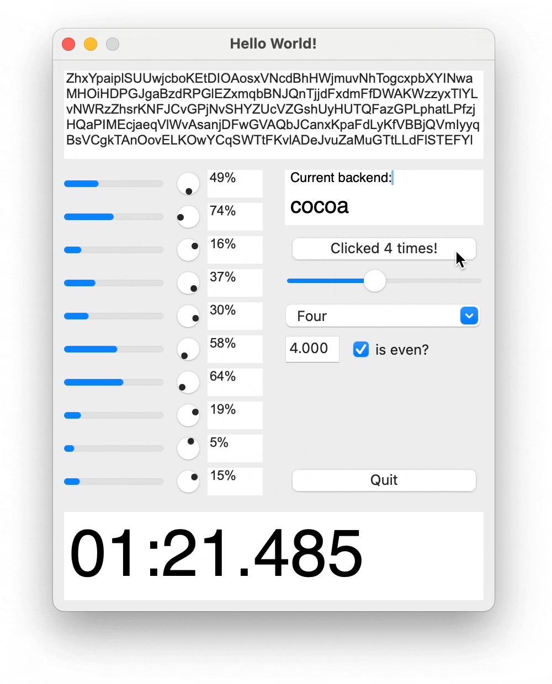

<p style="text-align:center"></p>

# Spot

[](https://pkg.go.dev/github.com/roblillack/spot)
[](https://goreportcard.com/report/github.com/roblillack/spot)

Spot is a simple, cross-platform, reactive GUI toolkit for Go using native
widgets where available. It is designed to be easy to use and to provide a
consistent API across different platforms.

## Example

```go
package main

import (
	"fmt"

	"github.com/roblillack/spot"
	"github.com/roblillack/spot/ui"
)

func main() {
	ui.Init()

	spot.MountFn(func(ctx *spot.RenderContext) spot.Component {
		counter, setCounter := spot.UseState[int](ctx, 0)

		buttonTitle := "Click me!"
		if counter > 0 {
			buttonTitle = fmt.Sprintf("Clicked %d times!", counter)
		}

		return &ui.Window{
			Title:  "Hello World!",
			Width:  200,
			Height: 125,
			Children: []spot.Component{
				&ui.Button{
					X: 25, Y: 50, Width: 150, Height: 25,
					Title: buttonTitle,
					OnClick: func() {
						setCounter(counter + 1)
					},
				},
			},
		}
	})

	ui.Run()
}
```

## Features

- **Simple**: You can add Spot as a simple dependency to your project and start
  building your UI right away. No need to use additional tools or code
  generation steps. Just write Go code and get a native GUI application as a
  self-contained binary.
- **Cross-platform**: Spot uses native widgets where available and
  automatically selects the best backend for the platform you are running on
  at compile time. Currently, two backend implementations are provided: one
  based on [FLTK](https://fltk.org) using
  [go-fltk](https://github.com/pwiecz/go-fltk) and one based on Cocoa using
  ([a modified version of](https://github.com/roblillack/gocoa))
  [gocoa](https://github.com/mojbro/gocoa).
- **Reactive**: Spot automatically updates the UI when the state of the
  application changes. You just provide side-effect free rendering functions
  and manage the state of your application using the [`UseState`](https://pkg.go.dev/github.com/roblillack/spot#UseState) hook.
- **Broad widget support**: Spot provides a wide range of UI controls out of
  the box, including buttons, labels, text inputs, sliders, dropdowns, and
  more. See the full list:
  [List of supported UI controls](#list-of-supported-ui-controls).

## FAQs

#### What does "reactive" mean?

In the context of Spot, _reactive_ means that the UI is automatically updated
when the state of the application changes. This is achieved by re-building an
immutable component tree upon state changes which can quickly be compared to
the previous state in order to determine what UI controls need to be updated.
In the web world, this idea is often called a "virtual DOM" and Spot actually
started as an experiment to bring this concept to Go by implementing a
React-like GUI library for the desktop.

By using a reactive model, the developer does not need to worry about updating
the UI manually. Instead, the developer can focus on the application logic and
let Spot take care of updating the UI.

#### What are the "native widgets" that Spot uses?

Currently, Spot uses a Cocoa backend on macOS and a FLTK-based one on all other
platforms. Optionally, FLTK can be used on the Mac, too. Better support for
Windows is planned for the future.

#### Can I implement my own hooks?

Yes, just like in React, you can implement your own hooks. Just create a
function which takes a `*spot.RenderContext` as first argument and use this to
"hook" into the Spot lifecycle by calling `spot.UseState`, `spot.UseEffect`,
etc. Convention here is to prefix the function with `Use…`.

#### How do I write custom components?

There are a few different ways to separate your UI into components in Spot;
for some ideas, check out the `custom-components` example. The main way to
write custom components is to create a struct that implements the
`spot.Component` interface. This interface has a single method,
`Render(ctx *spot.RenderContext) spot.Component`, which is called to render
the component. Components created like this can be used in the same way as
the built-in ones.

Look at the `BlinkingButton` component in the example to see how this is done.

#### Can I use Spot with a completely different widget library than the provided one?

Yes, you can. You just need to create some structs that implement the
`spot.Component` interface and which take care of managing the native widgets.

#### Can I use `spot/ui`, but with a different backend than Cocoa or FLTK?

Currently, these are the only backends that are supported. But feel free to
create a PR if you want to add support for another backend. _\*hint hint\*_

## Features, Spot does not have right now

- Automatic layouting
- Multiple windows
- Modal dialogs
- Resizable windows
- Menu bars
- Custom widgets
- Access to native widgets
- Drag and drop
- Internationalization

## List of supported UI controls

| Name      | Description                                              | Status                             | Cocoa                                         | FLTK                                                                        | GTK | Win32 |
| --------- | -------------------------------------------------------- | ---------------------------------- | --------------------------------------------- | --------------------------------------------------------------------------- | --- | ----- |
| Window    | Control representing a (top-level) window on the screen. | Done                               | NSWindow                                      | [Fl_Window](https://www.fltk.org/doc-1.4/classFl__Window.html)              | TBD | TBD   |
| Button    | Simple button to initiate an action.                     | Done                               | NSButton                                      | [Fl_Button](https://www.fltk.org/doc-1.4/classFl__Button.html)              | TBD | TBD   |
| Label     | A label control                                          | ?                                  | NSTextField                                   | [Fl_Output](https://www.fltk.org/doc-1.4/classFl__Output.html)              | TBD | TBD   |
| Text      | A text control                                           | ?                                  | NSTextView                                    | Text                                                                        | TBD | TBD   |
| TextInput | Control for single-line text input                       | ?                                  | NSTextField                                   | [Fl_Input](https://www.fltk.org/doc-1.4/classFl__Input.html)                | TBD | TBD   |
| Slider    | Horizontal slider input control                          | Done                               | NSSlider                                      | [Fl_Slider](https://www.fltk.org/doc-1.4/classFl__Slider.html)              | TBD | TBD   |
| Dial      | Circular status control                                  | Currently not supported by go-fltk | NSProgressIndicator (with `NSCircular` style) | [Fl_Dial](https://www.fltk.org/doc-1.4/classFl__Dial.html)                  | TBD | TBD   |
| Image     | An image control                                         | Not started                        | NSImageView                                   | Image                                                                       | TBD | TBD   |
| Dropdown  | A dropdown control                                       | Done                               | NSPopUpButton                                 | [Fl_Choice](https://www.fltk.org/doc-1.4/classFl__Choice.html)              | TBD | TBD   |
| ComboBox  | A combo box control                                      | Not started                        | NSComboBox                                    | ComboBox                                                                    | TBD | TBD   |
| Progress  | A progress control                                       | Done                               | NSProgress                                    | Progress                                                                    | TBD | TBD   |
| List      | A list control                                           | Not started                        | NSTableView                                   | List                                                                        | TBD | TBD   |
| Spinner   | Number input control with up/down buttons                | FLTK only                          | NSStepper                                     | [Fl_Spinner](https://www.fltk.org/doc-1.4/classFl__Spinner.html)            | TBD | TBD   |
| Checkbox  | A checkbox control                                       | Done                               | NSButton                                      | [Fl_Check_Button](https://www.fltk.org/doc-1.4/classFl__Check__Button.html) | TBD | TBD   |

## Potential future backends to look at

- Native Windows controls: https://github.com/rodrigocfd/windigo
