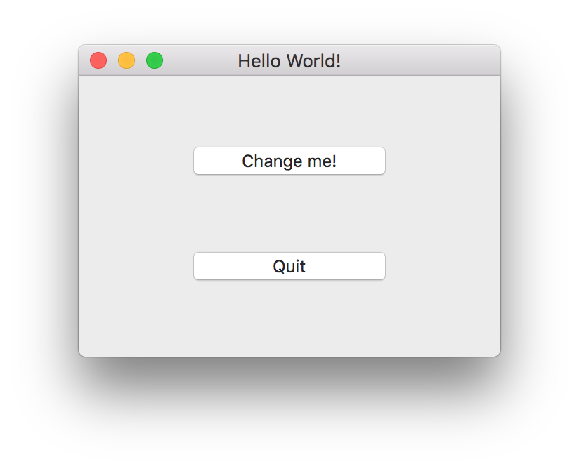

# gocoa
[](https://godoc.org/github.com/mojbro/gocoa)
[](https://goreportcard.com/report/github.com/mojbro/gocoa)

Go bindings for the Cocoa framework to build macOS applications.



## How to use

The following is the basic [Hello World](examples/helloworld) application.

```go
package main

import (
	"github.com/mojbro/gocoa"
)

func main() {
	app := gocoa.GetSharedApplication()
	width, height := 300, 200
	wnd := gocoa.NewWindow("Hello World!", 150, 150, width, height)
	buttonWidth, buttonHeight := 150, 24
	button := gocoa.NewButton(width/2-buttonWidth/2, height/2-buttonHeight/2, buttonWidth, buttonHeight)
	button.SetTitle("Click to quit app!")
	wnd.AddButton(button)
	wnd.MakeKeyAndOrderFront()
	app.Run()
}
```

## Status of this project

This package is very, very early and incomplete! It is mostly just an experiment and is not really
useful yet. I will continue working on it with the aim to be able to make useful native macOS apps in Go.
